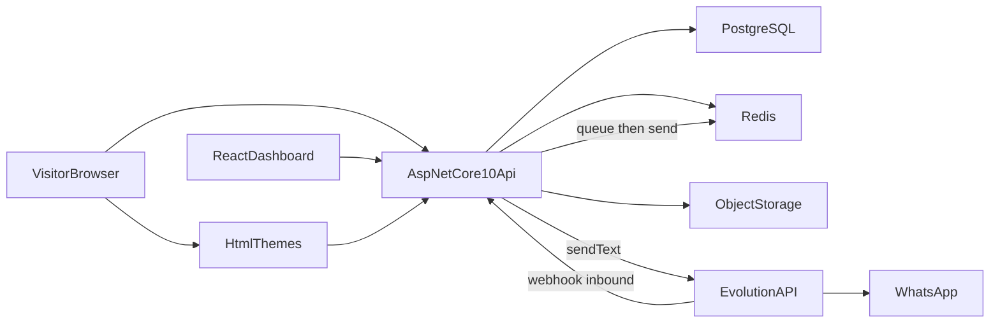

# DET — Detalhamento da Especificação Técnica — Allugme

**Versão:** 1.2  
**Data:** 2026-08-04  
**Stack:** ASP.NET Core 10 + React  
**Referências:** [PRD](02-prd.md) · [RBAC](rbac-matriz.md)

---

## 1. Arquitetura



| Componente | Responsabilidade |
|------------|------------------|
| **AlugueMe.Api** | REST + OpenAPI; auth; regras de tenant/agenda; orquestra WhatsApp |
| **React (dashboard)** | Painel B2B e admin SaaS (inclui config WhatsApp) |
| **themes/** | Vitrine HTML por tema oficial |
| **PostgreSQL** | Dados transacionais (fonte da verdade) |
| **Redis** | Cache, fila WhatsApp, locks de agenda, rate limit, idempotência de webhook |
| **Storage** | Fotos de imóveis (local/dev; S3-compatible em prod) |
| **Evolution API** | Envio/recebimento WhatsApp; webhook para a API |

Vitrine: server-side render ou arquivos estáticos gerados a partir dos temas + dados da API. Painel **não** compartilha UI com temas.

### 1.1 Usos do Redis no MVP

| Uso | Por quê |
|-----|---------|
| **Fila de envio WhatsApp** | Desacoplar `POST /visits` do HTTP à Evolution; retry sem perder a visita |
| **Lock distribuído na agenda** | Reduzir double-booking sob concorrência (além da transaction no Postgres) |
| **Cache de busca / slots** | Baixar carga no Postgres em listagens públicas e `visit-slots` (TTL curto) |
| **Idempotência de webhook** | Evitar processar duas vezes o mesmo evento Evolution |
| **Rate limiting** | Proteger API pública e webhook |

Chaves sugeridas (prefixo `alugueme:`): `lock:visit:broker:{id}`, `cache:search:{hash}`, `cache:slots:{propertyId}:{date}`, `queue:whatsapp`, `idem:evo:{messageId}`.

---

## 2. Estrutura de repositório (alvo)

```
AlugueMe/
├── backend/
│   ├── src/
│   │   ├── AlugueMe.Domain/
│   │   │   ├── Entities/              # User, Tenant, Property, Visit, …
│   │   │   ├── Enums/                 # Roles, VisitStatus, ConfirmedVia, …
│   │   │   └── Interfaces/            # contratos de domínio (se houver)
│   │   ├── AlugueMe.Application/
│   │   │   ├── Auth/
│   │   │   ├── Tenancy/
│   │   │   ├── Properties/
│   │   │   ├── Visits/                # slots, buffer, create/confirm
│   │   │   ├── Themes/
│   │   │   ├── WhatsApp/              # notify visit, parse SIM/NAO, test send
│   │   │   │   ├── Commands/
│   │   │   │   ├── Handlers/
│   │   │   │   └── Dtos/
│   │   │   └── Common/                # Result, interfaces (IEvolutionWhatsAppClient)
│   │   ├── AlugueMe.Infrastructure/
│   │   │   ├── Persistence/           # EF Core, DbContext, migrations
│   │   │   │   └── Seed/              # DemoSeed — 5 tenants × 5 temas
│   │   │   ├── Identity/
│   │   │   ├── Storage/               # fotos de imóveis
│   │   │   ├── Redis/                 # cache, locks, fila, idempotência
│   │   │   │   ├── RedisCacheService.cs
│   │   │   │   ├── RedisLockService.cs
│   │   │   │   ├── WhatsAppQueue.cs
│   │   │   │   └── RedisOptions.cs
│   │   │   ├── Evolution/             # cliente HTTP Evolution API
│   │   │   │   ├── EvolutionWhatsAppClient.cs
│   │   │   │   ├── EvolutionOptions.cs
│   │   │   │   └── EvolutionWebhookParser.cs
│   │   │   ├── Background/            # worker consome fila WhatsApp (Redis)
│   │   │   │   └── WhatsAppOutboundWorker.cs
│   │   │   └── DependencyInjection.cs
│   │   └── AlugueMe.Api/
│   │       ├── Controllers/           # ou Endpoints/
│   │       │   ├── AuthController.cs
│   │       │   ├── PropertiesController.cs
│   │       │   ├── VisitsController.cs
│   │       │   ├── SettingsController.cs      # buffer + WhatsApp
│   │       │   ├── PublicController.cs
│   │       │   └── Webhooks/
│   │       │       └── EvolutionWebhookController.cs
│   │       ├── Auth/
│   │       ├── appsettings.json
│   │       └── Program.cs
│   └── tests/
│       ├── AlugueMe.UnitTests/        # buffer, parse SIM/NAO
│       └── AlugueMe.IntegrationTests/ # Testcontainers: Postgres + Redis
├── frontend/
│   └── dashboard/                     # React + Vite + TS
│       ├── src/
│       │   ├── api/                   # client OpenAPI
│       │   ├── features/
│       │   │   ├── auth/
│       │   │   ├── properties/
│       │   │   ├── visits/
│       │   │   ├── settings/
│       │   │   │   ├── BufferSettings.tsx
│       │   │   │   └── WhatsAppSettings.tsx   # número, instance, teste
│       │   │   ├── themes/
│       │   │   └── admin/
│       │   ├── components/
│       │   ├── routes/
│       │   └── App.tsx
│       ├── package.json
│       └── vite.config.ts
├── themes/
│   └── official/
│       ├── moderno/                 # import Open Design
│       ├── urbano/
│       ├── classico/
│       ├── minimal/
│       └── porto/
│           ├── theme.json
│           ├── pages/                 # home, listing, property, schedule
│           ├── partials/
│           └── assets/
├── storage/                           # dev: media, logs
├── docker-compose.yml                 # postgres + redis (+ evolution opcional)
├── .env.example                       # ConnectionStrings + Redis + Evolution:*
└── docs/                              # documentação do produto
```


---

## 3. Modelo de dados (MVP)

### 3.1 Entidades

| Entidade | Campos principais |
|----------|-------------------|
| **User** | Id, Email, PasswordHash, Name, Phone, IsSaasAdmin |
| **Tenant** | Id, Name, Type (Agency\|Independent), Status (Active\|Suspended), ThemeKey, Slug |
| **TenantMembership** | UserId, TenantId, Role (AgencyAdmin\|Broker) |
| **Property** | TenantId, ResponsibleBrokerId, Operation (Sale\|Rent), Title, Description, City, Neighborhood, Price, Bedrooms, AreaSqm, PropertyType, Status (Draft\|Published\|Unlisted), CreatedAt |
| **PropertyMedia** | PropertyId, Url/Path, SortOrder |
| **TenantSettings** | TenantId, BufferMinutes, VisitDurationMinutes, WhatsAppE164?, EvolutionInstanceName?, WhatsAppNotifyEnabled |
| **BrokerSettings** | UserId, TenantId, BufferMinutes?, VisitDurationMinutes?, WhatsAppE164?, WhatsAppNotifyEnabled? |
| **AvailabilityRule** | BrokerId, Weekday, StartTime, EndTime (P1; MVP pode hardcode) |
| **CalendarBlock** | BrokerId, StartAt, EndAt, Reason |
| **Visit** | PropertyId, TenantId, BrokerId, VisitorName, VisitorPhone, VisitorEmail, StartAt, EndAt, BufferMinutesApplied, Status, ConfirmationCode, NotifiedAt?, ConfirmedVia (Panel\|WhatsApp\|null) |
| **WhatsAppOutboundLog** | Id, TenantId, VisitId?, ToE164, Payload/Status, Error, CreatedAt |

### 3.2 Índices sugeridos

- `Property (TenantId, Status)`, `Property (City, Neighborhood, Status)`  
- `Visit (BrokerId, StartAt, EndAt)`, `Visit (PropertyId)`, `Visit (ConfirmationCode)` unique  
- `Tenant (Slug)` unique  
- `TenantSettings / BrokerSettings (WhatsAppE164)` para resolver remetente no webhook  

### 3.3 Configuração de plataforma (appsettings / env)

| Chave | Uso |
|-------|-----|
| `ConnectionStrings:PostgreSQL` | Banco principal |
| `ConnectionStrings:Redis` | ex. `localhost:6379` |
| `Evolution:BaseUrl` | URL do servidor Evolution |
| `Evolution:ApiKey` | API key global (servidor) |
| `Evolution:WebhookSecret` | Validação do webhook inbound |

---

## 4. Auth e autorização

- ASP.NET Core Identity + JWT Bearer (ou cookie + antiforgery se SPA same-site).  
- Claims: `sub` (user id), `tenant_id` (contexto ativo), `role`, `is_saas_admin`.  
- Policies alinhadas a [rbac-matriz.md](rbac-matriz.md).  
- Todo handler de Application valida tenant do recurso vs claim (exceto saas_admin).

---

## 5. API — recursos MVP

Base: `/api/v1`

| Método | Rota | Auth | Descrição |
|--------|------|------|-----------|
| POST | `/auth/register` | — | Registro inicial |
| POST | `/auth/login` | — | Login |
| POST | `/auth/logout` | ✅ | Logout |
| GET | `/me` | ✅ | Usuário + memberships |
| GET/POST | `/tenants` | saas / bootstrap | Listar/criar |
| PATCH | `/tenants/{id}/status` | saas | Active/Suspended |
| GET/POST | `/properties` | ✅ tenant | Listar/criar |
| GET/PUT/DELETE | `/properties/{id}` | ✅ | Detalhe/editar/remover |
| POST | `/properties/{id}/publish` | ✅ | Publicar |
| POST | `/properties/{id}/media` | ✅ | Upload foto |
| GET | `/public/properties` | — | Busca pública (query filters) |
| GET | `/public/properties/{id}` | — | Detalhe público |
| GET | `/public/properties/{id}/visit-slots` | — | Slots livres (`?date=`) |
| POST | `/public/visits` | — | Solicitar visita |
| GET | `/visits` | ✅ | Agenda (filtro broker/tenant) |
| PATCH | `/visits/{id}` | ✅ | Confirmar/recusar/cancelar |
| GET/PUT | `/settings/tenant` | ✅ admin | Buffer/duração + WhatsApp tenant |
| GET/PUT | `/settings/broker` | ✅ broker | Override buffer + WhatsApp corretor |
| POST | `/settings/whatsapp/test` | ✅ | Envia mensagem de teste via Evolution |
| POST | `/agenda/blocks` | ✅ | Bloqueio |
| GET/PUT | `/tenants/me/theme` | ✅ admin | Tema oficial |
| POST | `/webhooks/evolution` | secret | Inbound WhatsApp (messages.upsert etc.) |

OpenAPI gerado automaticamente; cliente TypeScript para o React via NSwag/Kiota/openapi-generator.  
Webhook **fora** do JWT de usuário; autenticado por header/secret da Evolution.

---

## 6. Algoritmo de slots e buffer

```
duration = broker.VisitDuration ?? tenant.VisitDuration ?? 60
buffer   = broker.BufferMinutes ?? tenant.BufferMinutes ?? 60

occupied intervals = 
  foreach visit in (Pending|Confirmed) of broker on day:
    [visit.StartAt, visit.EndAt + visit.BufferMinutesApplied]
  + calendar blocks

candidate starts = every step (ex. 30 min) in working window
valid if [start, start+duration+buffer] does not intersect occupied
           (política MVP: próximo início >= end_ocupado_anterior,
            com end_ocupado = end_visita + buffer)
```

Persistir `BufferMinutesApplied` na Visit no momento da criação para auditoria.

Usar `TimeZoneInfo` / NodaTime com `America/Sao_Paulo`.

Concorrência: **Redis lock** `lock:visit:broker:{brokerId}` + transaction no Postgres (`SELECT … FOR UPDATE` / revalidação) antes do insert.

---

## 6.1 WhatsApp — Evolution API (MVP)

### Fluxo outbound (nova visita)

1. `POST /public/visits` persiste visita `pending` + gera `ConfirmationCode` (ex. 6 chars).  
2. Resolve destino: `BrokerSettings.WhatsAppE164` se notify enabled → senão `TenantSettings.WhatsAppE164`.  
3. Se não houver destino ou notify desligado → fim (visita ok sem WA).  
4. Monta texto com imóvel, visitante, data/hora, código e instruções:  
   `SIM {codigo}` para confirmar · `NAO {codigo}` para recusar.  
5. Enfileira job no **Redis** (`queue:whatsapp`); worker chama Evolution `sendText`.  
6. Grava `WhatsAppOutboundLog` + `Visit.NotifiedAt` se sucesso. Falha de envio **não** reverte a visita; retry controlado na fila.

### Fluxo inbound (webhook)

1. Evolution POST em `/api/v1/webhooks/evolution` (validar secret).  
2. Extrai número remetente (E.164) + texto.  
3. Parse: `^(SIM|NAO)\s+([A-Z0-9]{4,8})$` (case insensitive).  
4. Localiza `Visit` por `ConfirmationCode` em `pending`.  
5. Valida que remetente == WhatsApp configurado do broker responsável ou do tenant.  
6. Aplica confirmação/recusa com **mesmas** regras do `PATCH /visits/{id}`.  
7. `ConfirmedVia = WhatsApp`.  
8. Se `VisitorPhone` preenchido, envia WA de retorno ao visitante (confirmada/recusada).  
9. Resposta opcional de ACK ao corretor (“Visita confirmada.”).

### Cliente HTTP

Interface `IEvolutionWhatsAppClient` em Infrastructure: `SendTextAsync(instance, to, text)`.  
Timeouts + retry leve (1–2) só para falhas transitórias de rede.

---

## 7. Temas (vitrine)

### 7.1 Estrutura de um tema oficial

```
themes/official/{key}/
  theme.json
  pages/home.html
  pages/listing.html
  pages/property.html
  pages/schedule.html
  partials/header.html
  partials/footer.html
  partials/property-card.html
  assets/css/
  assets/js/
  assets/img/
```

### 7.2 theme.json (exemplo)

```json
{
  "key": "moderno",
  "name": "Moderno",
  "version": "1.0.0",
  "pages": ["home", "listing", "property", "schedule"]
}
```

### 7.3 Placeholders obrigatórios (MVP)

| Placeholder | Uso |
|-------------|-----|
| `{{tenant.name}}` | Nome |
| `{{tenant.logo_url}}` | Logo |
| `{{tenant.phone}}` | Contato |
| `{{properties}}` / loop | Listagem |
| `{{property.title}}` | Detalhe |
| `{{property.price}}` | Preço |
| `{{property.city}}` | Cidade |
| `{{property.neighborhood}}` | Bairro |
| `{{property.bedrooms}}` | Quartos |
| `{{property.operation}}` | sale/rent |
| `{{property.images}}` | Galeria |
| `{{search.filters}}` | Form busca |
| `{{visit.slots_endpoint}}` | URL API slots |
| `{{visit.submit_endpoint}}` | URL API visita |

Engine: Scriban / Fluid / Razor-as-template — **escape HTML por padrão**. Temas não executam C#/PHP do cliente.

### 7.4 Resolução de tenant na vitrine

MVP: path ou subdomínio `/{tenantSlug}/...` ou `{slug}.plataforma.local`.

---

## 8. Frontend React

- Vite + React + TypeScript  
- React Router  
- Client HTTP tipado a partir do OpenAPI  
- Estado: TanStack Query (recomendado)  
- Áreas: `auth`, `properties`, `visits`, `settings` (buffer + **WhatsApp/Evolution**), `admin`  

Não implementar os temas da vitrine em React (ficam em `themes/official`).

---

## 9. Segurança

| Tema | Medida |
|------|--------|
| Tenant isolation | Filtro global EF / validação Application |
| Uploads | whitelist image/*, max size, nomes UUID |
| XSS vitrine | escape de placeholders |
| CSRF | conforme modo auth cookie |
| Secrets | User Secrets / env vars |
| CORS | origins do dashboard + vitrine |
| Evolution secrets | só servidor; webhook com secret |
| WhatsApp commands | validar remetente = número configurado |

---

## 10. Testes

| Camada | Foco |
|--------|------|
| Unit | Cálculo de slots/buffer; parse SIM/NAO; policies |
| Integration | API + Testcontainers Postgres **e Redis**; Evolution mock/fake |
| Aceite | Casos em [05-plano-aceite.md](05-plano-aceite.md) |

---

## 11. Deploy (alto nível)

| Ambiente | Notas |
|----------|-------|
| Dev | Docker Compose: api, postgres, **redis**, (evolution/minio opcional) |
| Prod | API + SPA estático + Postgres + **Redis** + blob |

---

## 12. P1/P2 técnicos (não MVP)

- Tema custom: pasta `themes/custom/{tenantId}/vNNN`, quarentena ZIP, approve workflow  
- Static site generation on publish  
- AvailabilityRule completa  
- MAUI consumindo a mesma API  
- Cache avançado (invalidação por tag, CDN) além do Redis básico do MVP  

---

## 13. Rastreabilidade PRD → DET

| REQ | Cobertura DET |
|-----|---------------|
| REQ-AUTH-* | §4 |
| REQ-TEN-* | §3, §4, §5 |
| REQ-PROP-* | §3, §5 |
| REQ-SRC-* | §5, §7 |
| REQ-VIS-* | §5, §6, §6.1 |
| REQ-WA-* | §3, §5, §6.1, §8 |
| REQ-UI-* | §8 |
| REQ-SEED-* | [06-seed-demo-tenants.md](06-seed-demo-tenants.md); Infrastructure/Persistence/Seed |
| REQ-NFR-* / REQ-INF-* | §1.1, §9, §10, §11 |
