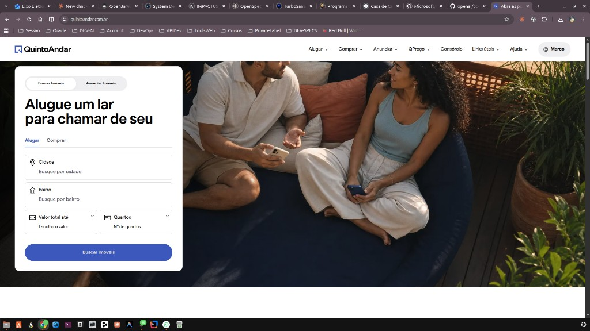
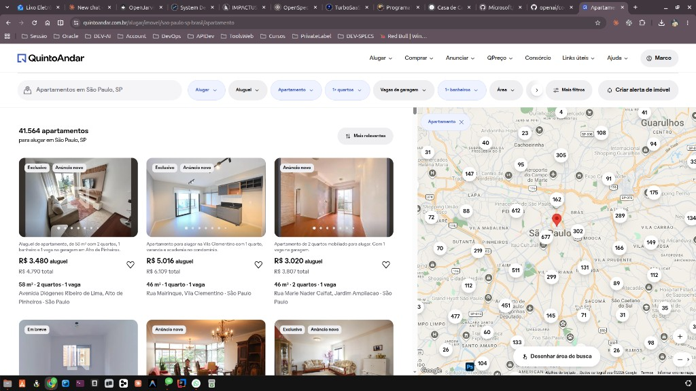

# Referência de apresentação — Busca e listagem de imóveis

**Versão:** 1.2  
**Data:** 2026-08-04  
**Uso:** Padrão visual/UX para **home (busca)** e **resultados (listagem + mapa)** da vitrine — especialmente o tema `urbano`.  
**Fonte:** QuintoAndar (referência de mercado).  
**Aviso:** Referência de design apenas — **não** usar logo, nome ou assets proprietários do QuintoAndar em produção.

Implementação alvo: tema **`urbano`** (`themes/official/urbano/`).

---

## A. Home — card de busca no hero

Arquivo: [`references/quintoandar-busca-imoveis.png`](references/quintoandar-busca-imoveis.png)

### Anatomia

| Zona | Conteúdo | Notas |
|------|----------|--------|
| **Header** | Logo/nome · Alugar · Comprar · links · Entrar | Barra branca, tipografia sans |
| **Hero** | Foto lifestyle edge-to-edge | Sem overlays de badge |
| **Card de busca** | Flutuante à esquerda sobre o hero | Radius ~24px, sombra suave |
| **Pills de modo** | Buscar Imóveis (ativo) / Anunciar Imóveis | Segmented control pill |
| **Título** | Headline dentro do card | Forte, 1 linha |
| **Tabs operação** | Alugar \| Comprar | Ativo: primária + underline |
| **Campos** | Cidade, Bairro, Valor até, Quartos | Ícone à esquerda |
| **CTA** | “Buscar Imóveis” full-width | Azul royal sólido |

### Regras UX (home)

1. Busca é o herói da interação.  
2. Alugar/Comprar no mesmo fluxo (tabs).  
3. Um CTA primário óbvio.  
4. Mobile: card full-width; hero como plano de fundo.  
5. Marca no header = `{{tenant.name}}` (nunca QuintoAndar).

---

## B. Resultados — lista + mapa

Arquivo: [`references/quintoandar-listagem-mapa.png`](references/quintoandar-listagem-mapa.png)

### Layout de alto nível

| Zona | Proporção / comportamento | Notas |
|------|---------------------------|--------|
| **Coluna esquerda** | ~55–60% | Lista/grid scrollável de cards |
| **Coluna direita** | ~40–45% | Mapa fixo (sticky) na viewport |
| **Header** | Sticky top | Logo · nav · conta |
| **Barra de filtros** | Sticky abaixo do header | Query + chips + ações |

### Barra de filtros

| Elemento | Exemplo | Notas |
|----------|---------|--------|
| Campo de contexto | “Apartamentos em São Paulo, SP” | Editável / local da busca |
| Chips | Aluguel · Preço · Tipo · Quartos · Vagas · Banheiros · Área | Pills com dropdown |
| Mais filtros | Botão secundário | Abre drawer/modal |
| Alerta | “Criar alerta de imóvel” + ícone | Opcional no MVP (P2) |

### Cabeçalho da lista

- Contagem: “N apartamentos…”  
- Ordenação: dropdown (“Mais relevantes”, etc.)

### Card de imóvel (grid ~3 colunas no desktop)

| Camada | Conteúdo |
|--------|----------|
| Mídia | Carrossel de fotos + dots |
| Badges (opcional) | Ex.: novo, exclusivo — só se houver dado real |
| Favorito | Ícone coração (P2 se não houver conta) |
| Preço | Destaque bold (“R$ X aluguel”) + total mensal menor |
| Specs | `m² · quartos · vagas` |
| Local | Rua / bairro |

### Mapa

- Clusters numéricos por zoom (evitar milhares de pins).  
- Pin ativo para destaque / hover do card.  
- Controles: zoom, tipo de mapa.  
- CTA flutuante opcional: “Desenhar área de busca” (P2).  
- Provider a definir na implementação (Leaflet / Mapbox / Google) — a referência é o **padrão UX**, não o vendor.

### Regras UX (listagem)

1. **Split lista + mapa** no desktop; no mobile, lista primeiro e mapa em aba/drawer.  
2. **Filtros sticky** — sempre acessíveis ao scroll.  
3. **Card scannable** — foto → preço → specs → local.  
4. **Clusters no mapa** — obrigatório com volume alto.  
5. Sync opcional: hover/click no card destaca pin (e vice-versa).  
6. Não copiar marca QuintoAndar.

---

## C. Design tokens (compartilhados)

| Token | Valor de referência | Uso |
|-------|---------------------|-----|
| Primária / CTA | `#2D4EB9` | Botões, chips ativos, marca |
| Hover primária | `#243F9A` | Hover |
| Texto | `#1A1A1A` | Títulos e preço |
| Muted | `#6B7280` | Meta, placeholders |
| Borda | `#E5E7EB` / `#D1D5DB` | Inputs, chips |
| Superfície | `#FFFFFF` | Header, cards, filtros |
| Radius card busca | `24px` | Home |
| Radius chip / pill | `999px` | Filtros |
| Radius mídia card | `12–16px` | Foto do imóvel |
| Sombra card | `0 8px 32px rgba(15,23,42,.12)` | Elevação |
| Fonte | Nunito Sans (ou equivalente) | UI |

No código: `themes/official/urbano/assets/css/main.css` (`:root`).

---

## D. Mapeamento no Allugme

| Elemento da referência | Onde está / deve estar |
|------------------------|------------------------|
| Home + card de busca | `themes/official/urbano/pages/home.html` |
| Listagem resultados | `themes/official/urbano/pages/listing.html` |
| Card reutilizável | `themes/official/urbano/partials/property-card.html` (se existir) |
| Tokens / CSS | `themes/official/urbano/assets/css/main.css` |
| Tenant seed deste visual | `vista-urbana` → tema `urbano` ([06-seed-demo-tenants.md](../06-seed-demo-tenants.md)) |
| Preview | [index dos temas](../../themes/official/index.html) |

### Escopo MVP vs P2 nesta referência

| Item | MVP | P2 |
|------|-----|-----|
| Split lista + mapa | Sim (mapa pode ser estático/simplificado se API atrasar) | Clusters + desenhar área |
| Chips de filtro | Sim (subset: operação, preço, tipo, quartos) | Área, vagas, banheiros, mais filtros |
| Alerta de imóvel | Não | Sim |
| Favoritar | Não (sem conta pública) | Com conta |
| Sync card ↔ pin | Desejável | Obrigatório polido |

---

## E. Uso em demos / aceite

1. Home `urbano`: card de busca no hero.  
2. Listing `urbano`: lista + mapa + chips.  
3. Seed `/t/vista-urbana/` como vitrine “estilo mercado”.  
4. Comparar com os outros 4 temas para mostrar troca de layout.

---

## F. Fora do escopo

- Telas internas (conta, propostas, QPreço, etc.)  
- Cópia de textos/marca QuintoAndar  
- Replicar este DS nos outros 4 temas oficiais  
